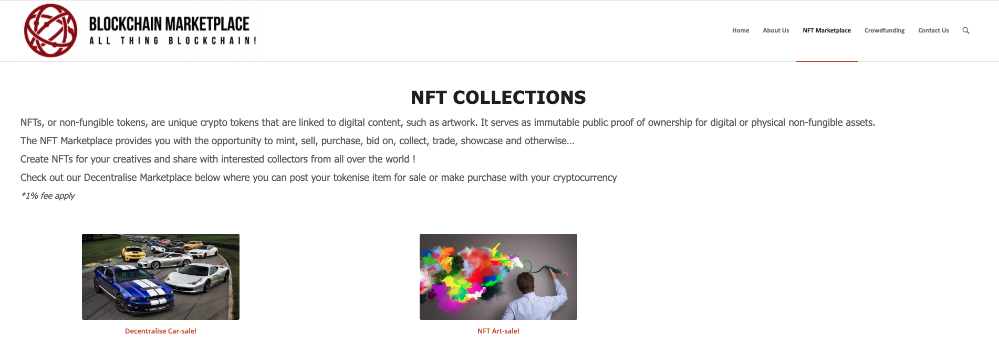
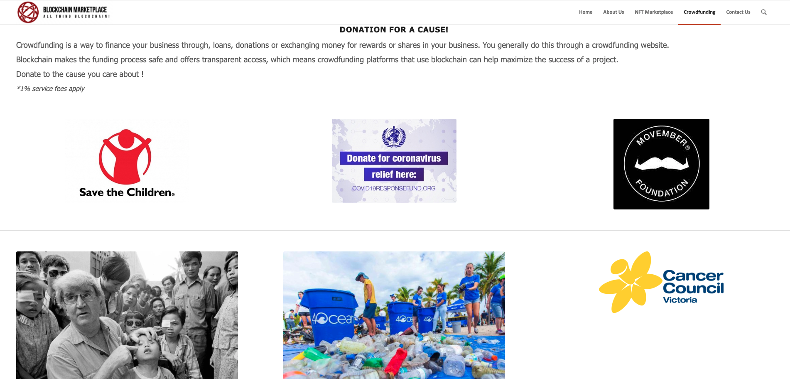
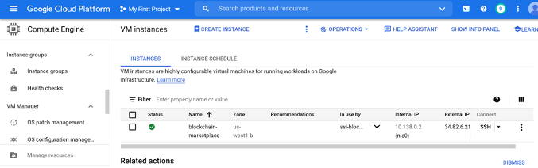
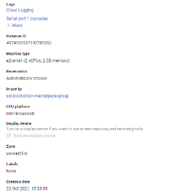
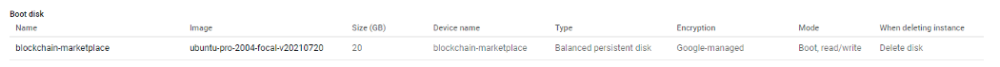
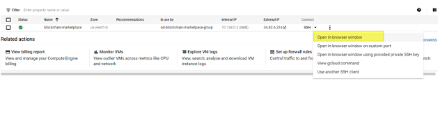
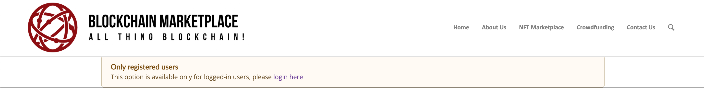
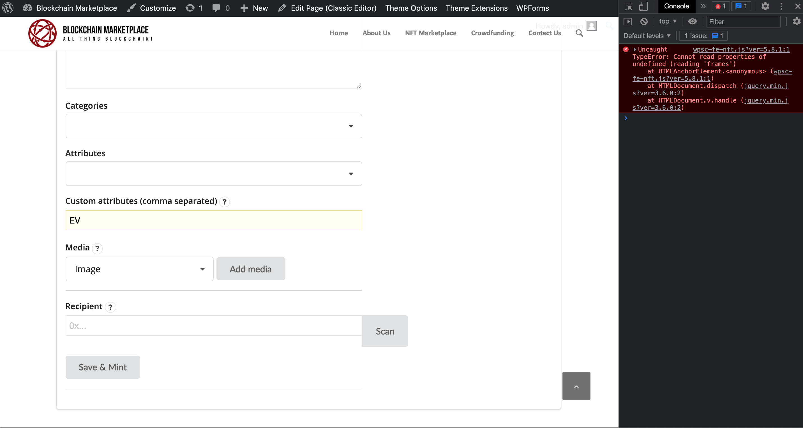

# Project 3 : Blockchain Marketplace - website : http://34.82.6.216/ 

Today, with the advent of blockchain technology, we are witnessing a new cycle of market development. The blockchain is changing almost every industry, offering new opportunities for markets and changing the way we transact online and in our daily lives. That is why we decided to create a decentralization blockchain-based marketplace to facilitate peer-to-peer exchange. Since a blockchain-based marketplace removes intermediaries, all transactions are traceable on a public ledger, demonstrating a high level of security and transparency. Our 3 main services are NFT Marketplace, Crowdfunding and Coin offering.

Smart Contracts are programs that can be executed, store information and interact with a Blockchain. Our website, Blockchain Marketplace, is built on WP Smart Contracts, which utilize the Ethereum blockchain technology. The two contracts that we used are NFT Matcha Smart contract (ERC-721) and Mango Safe Crowdfunding. ERC-721 is a standard for non-fungible tokens (NFT) or deeds. NFT are useful to represent digital or physical assets that cannot be divided. Mango Safe Crowdfundings are simple crowdfunding campaigns that can receive contributions in Ether.

### Blockchain Marketplace website : http://34.82.6.216/ 

Video is saved on Google Drive as it was too big to upload to GitHub. Here is the link : https://drive.google.com/file/d/1sDhJxWSTGr71fqW8aSM-cxklHeS02Rjl/view?usp=sharing

A Wordpress deployment (PHP installer package) is on the following link: https://drive.google.com/drive/folders/1DvzbJzul5B7VUHg2cwAL-0fW4HdKeDJN?usp=sharing

Admin link http://34.82.6.216/wp-admin

The site might be taken offline after the course ends!!

## NFT Market Place

Our NFT Marketplace features the following two product lines:
1.	Car Sales: Want fast and safe transfer of ownership for your new car purchase?
Why NFT: The record of ownership cannot be amended, that individual NFT cannot be replicated, and there can only be one official owner at a time.
Why buy with us: We work with some of the best car dealers in the country ! Check out our new collections yourself.
2.	Art Sales: We brings together artists, creators, and crypto enthusiasts on a single platform to create and trade top NFTs.
Why NFT: Once released, the number of that original NFT in existence cannot be changed. Even if you were to mint the same digital artwork again, it would still be a different NFT. Unlike with other collectibles, especially digital artworks, that scarcity is 100% verifiable - it is built into the NFT itself.
Why buy with us: Buy premium and exclusive NFTs created by global leading artists, and you can : Mint, purchase, and bid on NFTs from creators around the world

## Crowdfunding

Crowdfunding allows companies with really great product and service ideas to raise money from ordinary people in small amounts. If it works, it can really give your business a huge boost. Companies like Kickstarter, Indiegogo and Crowdfunder were among the first to popularize it. One problem is that the model remains extremely inefficient even when it comes to crowdfunding. According to Kickstarter, 78% of campaigns that reach 20% of their goal end up being fully funded, while 11% of projects end without receiving any funding. This brings us to the question of how blockchain is changing the crowdfunding landscape. Blockchain makes the funding process secure and provides transparent access, which means crowdfunding platforms using blockchain can help maximize the success of a project. In blockchain marketplace, we are currently create few funding for popular charities in Australia such as "Save the children", "Covid relief fund", "Movember", "Fred Hollows", "4Ocean", "Cancer Council" using Mango Safe Crowdfunding. Mango Safe Crowdfundings are simple crowdfunding initiatives that accept Ether as a form of contribution. Only with the consent of the contributors can the owner spend the donations.

## Initial Coin Offerings (ICOs)

Companies create their own cryptocurrency that behaves similarly to company stocks. Initial Coin Offerings (ICOs) are offers of a new cryptocurrency on a blockchain platform. It is similar to other crowdfunding platforms where the creators of the project. This is currently under development.

We will revert back to it soon.

## Technical Discussion

### Deploying the website

We consider some cloud hosting platform to deploy our website:

* AWS
* Google Cloud
* Heroku 

We decided to go with google cloud platform (GCP) due to it offer free credit for testing purpose as well as the flexibility of the platform.

With Google cloud service, we create a Virtural Machine (VM) instance with the below config:

The VM Machine is then deployed LAMP (Linux + Apache + MySQL + PHP/Perl/Python) via SSL command line:

### WP Smart Contract Plugin

For this project, WP Smart Contract plugin (https://wpsmartcontracts.com/) was used. It is free to use and helps create ICOs, NFTs, MFT Marketplace and Crowdsourcing solutions. It offers to auto generate smart contracts and supports multiple blockchains and test nets. This is one of the limitation of the plugin.

### Bugs

In Bloclchain Marketplace website, there are few bugs that we have come across which the team could not fix in the time frame given to us.

1. Plugin enforces users to login before allowing to mint an item. This one of the limitations of the plugin and we were not able to find a way around it.

2. Unable to mint NFT from the frontend even when logged in with administrator privileges. This is a bug in our website and we haven't been able to find the bug that is causing it.

## Learnings

1. As a team, using Wordpress was a new learning experience. It allowed us to create a working marketplace and take it even a step further by hosting it on GCP.

2. Using Wordpress and plugin ecosystem, allows team members to focus on business development while keeping the cost and effort of product development to a minimum.

3. There are limitations as to what plugins allow us to do so that limits the ability to customise the functionality.

